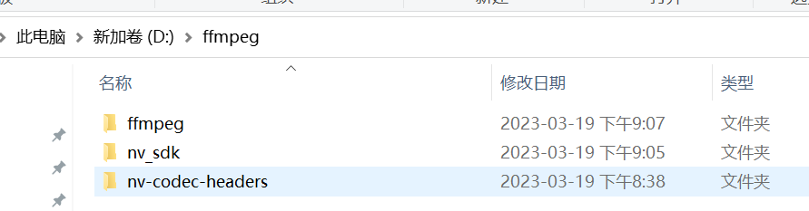
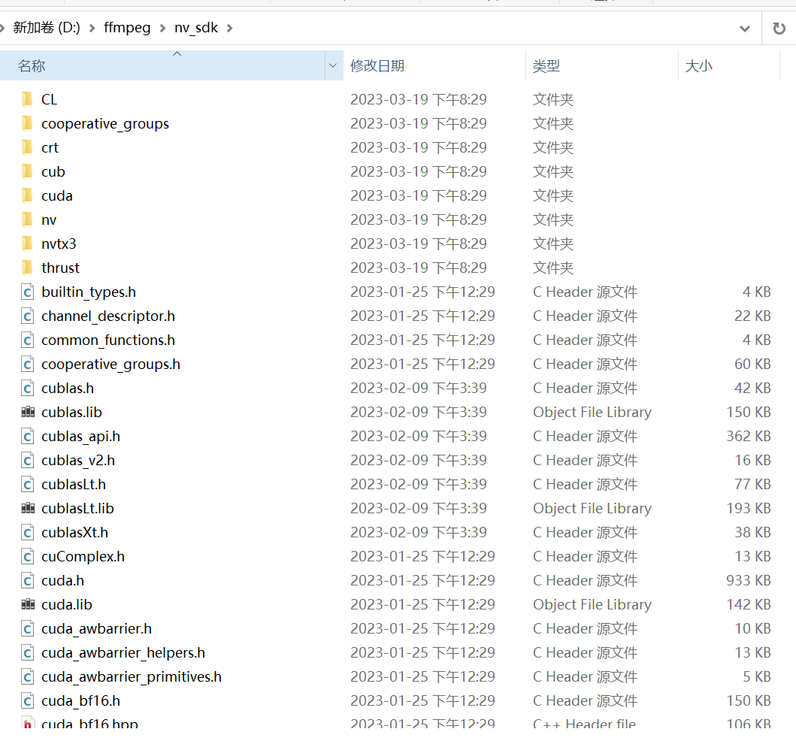
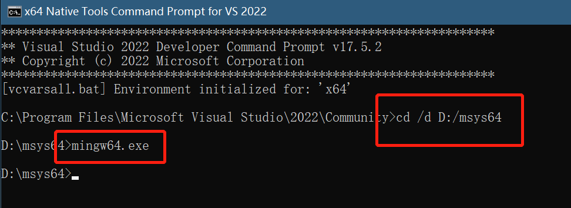
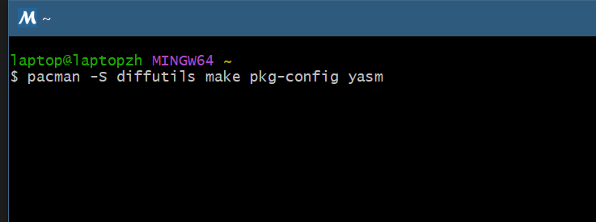

# WARNING WARNING WARNING WARNING 

You need to replace the **absolute path** show in this article according to the installation path of your **VS2022**, **CUDA toolkits**,**msys2** and the **Working directory**.

**IF YOU JUST COPY ALL THE PATH I USED HERE,YOU ARE DOOMED TO FAIL.**

[ORIGINAL FFMPEG-WITH-NVIDIA-GPU](https://docs.nvidia.com/video-codec-sdk/11.0/ffmpeg-with-nvidia-gpu/index.html)


# Compiling for window

- install [Microsoft Visual Studio 2022 community version](https://visualstudio.microsoft.com/downloads/).
- install [CUDA toolkit v12.1.0](https://developer.nvidia.com/cuda-toolkit-archive).(Only need when we compile,not needed to run the FFmpeg compiled binaries).
- install git tools [Git for Windows](https://gitforwindows.org/).
- install [msys2](https://www.msys2.org/).
- create an empty folder as your <span style="color:orange">**working directory**</span>. **eg:"D:/ffmpeg"**.
- clone ffnvcodec to <span style="color:orange">**working directory**</span>

```
git clone https://git.videolan.org/git/ffmpeg/nv-codec-headers.git
```

- clone FFmpeg to <span style="color:orange">**working directory**</span>.
  
```
git clone https://git.ffmpeg.org/ffmpeg.git
```

- create folder **nv_sdk** in <span style="color:orange">**working directory**</span>.

now your <span style="color:orange">**working directory**</span> looks like this:

- copy header files to **nv_sdk** from "D:/Program Files/NVIDIA GPU Computing Toolkit/CUDA/v12.1/include".
- copy library files to **nv_sdk** from "D:/Program Files/NVIDIA GPU Computing Toolkit/CUDA/v12.1/lib/x64".

now your **nv_sdk** folder looks like this:

- Launch **Visual Studio x64 Native Tools Command Prompt**.You can find it here : **C:\ProgramData\Microsoft\Windows\Start Menu\Programs\Visual Studio 2022\Visual Studio Tools\VC** or here : **C:\Program Files\Microsoft Visual Studio\2022\Community\VC\Auxiliary\Build\vcvars64.bat**
- From the Visual Studio x64 Native Tools Command Prompt, launch the MinGW64 environment by running mingw64.exe from the msys2 installation folder.
- In the MinGW64 environment, install the necessary packages.

```
    pacman -S diffutils make pkg-config yasm
```

NOTE:Almost all the commands are running in MinGW64 environment from now on.

- Add the following paths by running the commands.

```
export PATH="/c/Program Files/Microsoft Visual Studio/2022/Community/VC/Tools/MSVC/14.35.32215/bin/Hostx64/x64/":$PATH

export PATH="/d/Program Files/NVIDIA GPU Computing Toolkit/CUDA/v12.1/bin/":$PATH
```

- Goto nv-codec-headers directory and install ffnvcodec

```
make install PREFIX=/usr
```

- Go to the FFmpeg installation folder and run the following command.

```
./configure --enable-nonfree --enable-shared --enable-cuda --enable-cuvid --enable-ffnvcodec --enable-nvdec --enable-nvenc --enable-libnpp --toolchain=msvc --extra-cflags=-I../nv_sdk --extra-ldflags=-libpath:../nv_sdk
```

- Compile the code by executing the following command.

```-git
make -j 8
```
